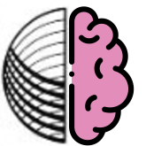

# LANG-BF

## NOTE

This project is currently on hold.

Should anyone wish to complete it, please contact Andrew Shapton on **alshapton (at) gmail (dot) com**

## Introduction

A [SPHERE-1](https://sphere.computer) Interpreter for the classic [Esoteric Programming Language (esolang)](https://en.wikipedia.org/wiki/Esoteric_programming_language) BrainF***.

This is not meant to be a tutorial for the Brainf***. language. For information about the language, see the very informative [Wikipedia entry](https://en.wikipedia.org/wiki/Brainfuck).

## Language Specification

There is no official specification for the language, however, the minimal canonical specification does state the complete language grammar as part of the explanation as to what the language is about and what its purpose is.

<https://esolangs.org/wiki/brainfuck>

A list of [language characters](./doc/language.md) is included here for convenience.
