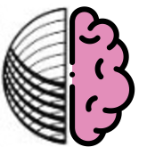

# LANG-BF

A [SPHERE-1] Interpreter for the classic [Esoteric Programming alanguage (esolang)](https://en.wikipedia.org/wiki/Esoteric_programming_language) BrainF***.

This is not meant to be a tutorial for the Brainf***. language. For information about the language, see the very informative [Wikipedia entry](https://en.wikipedia.org/wiki/Brainfuck).

## Implementation Specifics

As noted in [this section](https://esolangs.org/wiki/brainfuck#Implementation_issues) of the [esolang wiki page for BrainF***](https://esolangs.org/wiki/brainfuck), there are various implementation specifics which need to be understood, since there is no accepted global standard for implementations.

These implementation specifics are:

### Cell range
Each cell will have a value of 0 < n 255 - note these are unsigned integers.

Cell values will wrap i.e.:

<pre>
255 + 1 = 0
0 - 1 = 255
</pre>

### ASCII Characters
Only printable-characters will be output correctly.

The set of characters that the SPHERE-1 recognises is shown [here](doc/ascii.png) (taken directly from Appendix B of the Sphere-1 Operator's Manual). Note that there are many unprintable characters also shown in this list, and that it is 7-bit ASCII i.e. no characters with a value of greater than 127 are available.
It is also worth noting that without a modification, only upper case characters are printable with the base SPHERE-1 implementation.
