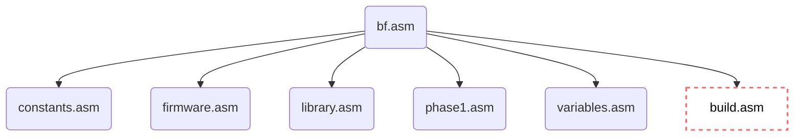

## Memory Map

Base SPHERE-1 has 4K of RAM available mapped out as below (including the space used by the BrainF**k interpreter):

|From*| To* |Size (bytes)  |        Purpose        |
|-----|-----|:------------:|-----------------------|
|     |01FF |512           |Reserved               |
|0200 |05FF |1024          |Interpreter            |
|0A00 |0DFF |1024          |Working Storage        |
|0600 |08FE |1024          |Program,Data & Input   |
|09FF |0AFE |256           |Tape storage           |
|0E00 |0FFF |512           |Stack (Starts at $E00)+|

***\**** Values in Hex

***+*** *Given a 256-byte program, this should give enough space*

### Program Structure

The structure of the BrainF**k interpreter for Sphere-1 is shown below:

*build.asm* is dynamically generated during the build, and removed post-build

[Back to Main Page](../README.md)