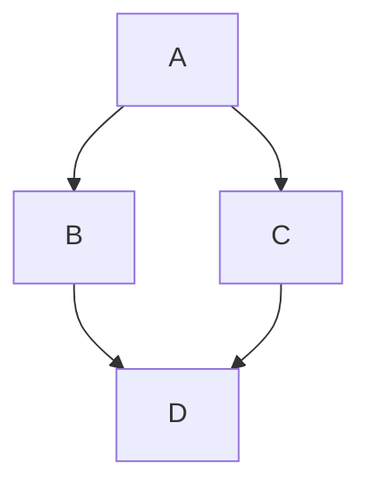

# Suggestion from @BenZotto - use editor as the means to enter BF programs

- Use CTRL-E to enter the editor from the executive
- Use CTRL-R to RE-EDIT the existing code.

    - BUFADR  is the start of the source code   Starts at 0x200
    - BUFEND  is the end of the source code     Maximum is 0xFFF

#### Editor Controls ####
    
    - CTRL-L    Set cursor to the home position
    - CTRL-X    Clears the screen from the cursor position to the bottom of the screen
    - CTRL-Q    Moves the cursor up one line
    - CTRL-R    Moves the cursor right one character
    - CTRL-S    Moves the cursor down one line
    - CTRL-T    Moves the cursor one character to the left
    - CTRL-DEL  Moves the cursor to the left of the screen
    - CTRL-D    Deletes the top line of the CRT
    - CTRL-I    Insert a new line at the top of the CRT
    - CTRL-E    Enter editor
    - CR        Moves the cursor to the next line at the left of the screen
    - ESC       Exit the editor
    

# Hello World! program

>++++++++[-<+++++++++>]<.>>+>-[+]++>++>+++[>[->+++<<+++>]<<]>-----.>->+++..+++.>-.<<+[>[+>+]>>]<--------------.>>.+++.------.--------.>+.>+.

# BF Specification (as canonical as I can find)

https://esolangs.org/wiki/brainfuck

# Talk by BF inventor (Urban Müller)
https://www.youtube.com/watch?v=gjm9irBs96U&t=8722s

# Additional ideas:

-   Maybe use `!` to indicate start of data
-   Maybe use `#` to indicate start of input

.... so the program can be in one file along with its input and data.

Possibly support standard input where there is no input given

# Memory Map 

Base SPHERE-1 has 4K of RAM available mapped out as below:

|From*| To* |Size (bytes)        |        Purpose        |
|-----|-----|--------------------|-----------------------|
|     |01FF |
512
 |Reserved               |
|0200 |05FF |
1024
|Interpreter            |
|0600 |09FF |
1024
|Program,Data & Input |
|0A00 |0DFF |
1024
|Working Storage        |
|0E00 |0FFF |
512
 |Stack (Starts at $E00)+|

<i><b>*</b> Values in Hex</i>

<i><b>+</b> Given a 256-byte program, this should give enough space</i>

Use the debug monitor to enter programs in hex mode, starting at 0600

